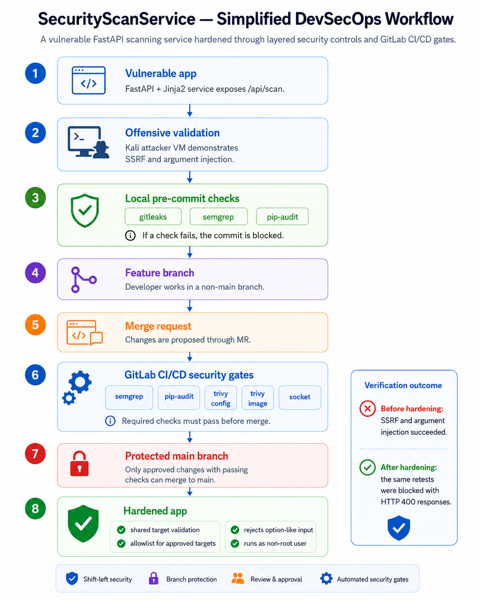
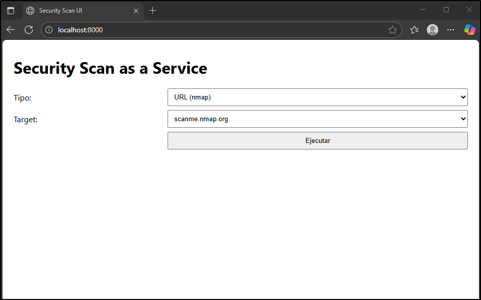
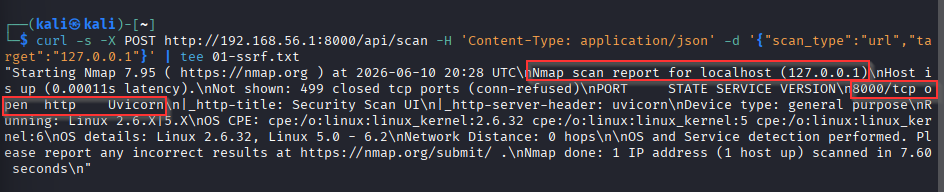
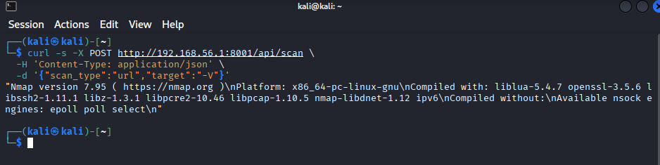
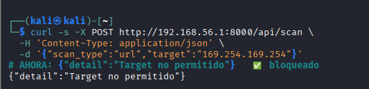
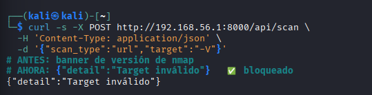
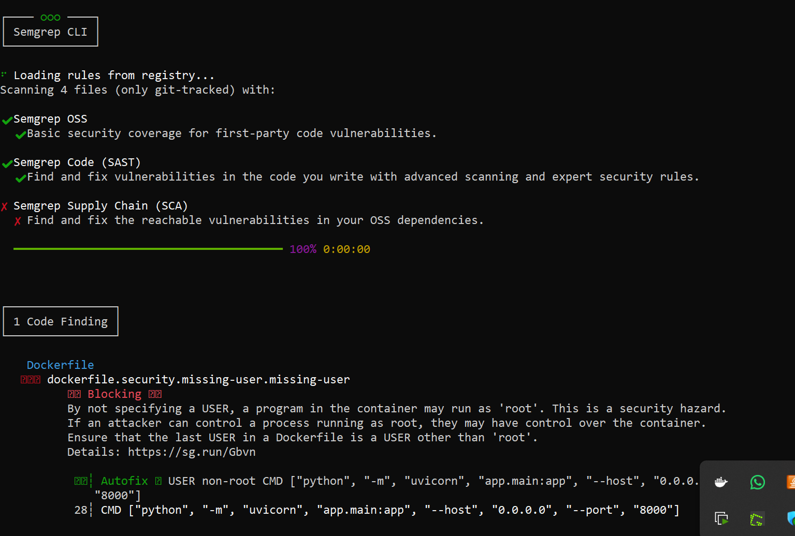
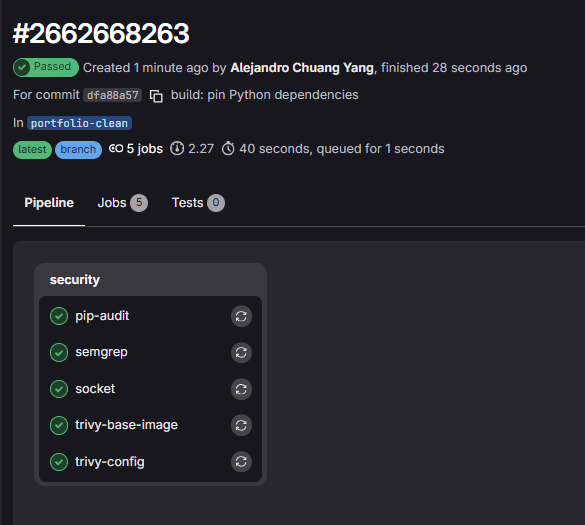

# DevSecOps Security Pipeline

SecurityScanService is a deliberately vulnerable FastAPI scanning service used to demonstrate offensive validation, secure coding controls, protected branches, and GitLab CI/CD security gates.

> **CI/CD note:** The pipeline was designed and validated in GitLab CI/CD.  
> GitHub is used as the public portfolio mirror.



## Overview

SecurityScanService provides a small web interface and API for:

- scanning an approved host with Nmap;
- scanning an approved container image with Trivy.

The application was initially tested from a separate Kali Linux attacker VM. The assessment identified two weaknesses in the API:

- server-side scanning of arbitrary internal targets;
- argument injection into Nmap.

The application was then hardened, the same attacks were repeated, and the remediations were verified manually and through automated tests.

## Application



The public demo is intentionally restricted to:

| Scan type | Approved target |
|---|---|
| Nmap | `scanme.nmap.org` |
| Trivy | `ubuntu:latest` |

## Security findings

### Before hardening

| SSRF / arbitrary server-side scanning | Argument injection |
|---|---|
| The API accepted `127.0.0.1` and scanned an internal service. | The value `-V` was interpreted as an Nmap option. |
|  |  |

### Remediation

A shared validation layer was applied to both the web interface and API:

- allowlist of approved targets;
- rejection of option-like inputs beginning with `-`;
- unsupported scan types rejected before command execution;
- container execution changed from root to a non-privileged user.

### Verification after hardening

| SSRF retest | Argument injection retest |
|---|---|
| Cloud metadata endpoint requests are rejected with HTTP 400. | Option-like input is rejected before Nmap executes. |
|  |  |

Automated tests also verify that rejected input never reaches `subprocess.run()`.

## DevSecOps controls

### Local pre-commit controls

| Control | Purpose |
|---|---|
| Gitleaks | Detect hardcoded secrets |
| Semgrep | Static application security testing |
| pip-audit | Detect known vulnerabilities in Python dependencies |

A failed control blocks the local commit.



### GitLab CI/CD security gates

The GitLab pipeline runs security jobs in parallel:

| Job | Coverage | Policy |
|---|---|---|
| Semgrep | Application code and Dockerfile | Blocking |
| pip-audit | Python dependencies | Blocking |
| Trivy config | Container configuration | Informational |
| Trivy image | Base-image OS vulnerabilities | Informational |
| Socket | Supply-chain and dependency risk | Blocking |



The `main` branch is protected, direct pushes are rejected, and changes must enter through a merge request with the required checks passing.

## Run locally

### Docker

```bash
docker build -t securityscanservice .
docker run --rm -p 8000:8000 securityscanservice
```

Open `http://localhost:8000`.

### Tests

```bash
python -m venv .venv
source .venv/bin/activate
pip install -r requirements.txt -r requirements-dev.txt
pytest -q
```

The automated test suite verifies:

- application availability;
- approved Nmap execution;
- localhost and cloud-metadata SSRF blocking;
- Nmap option and script argument injection blocking;
- rejected inputs never reach `subprocess.run()`.

## Key design decisions

- Validate all targets before executing system commands.
- Use deterministic tools as security gates.
- Combine fast local feedback with enforceable CI/CD checks.
- Run the application as a non-root user.
- Exclude development dependencies from the runtime image.
- Keep each security tool focused on a distinct responsibility.

## Technology

Python · FastAPI · Jinja2 · Docker · Nmap · Trivy · GitLab CI/CD · Semgrep · Gitleaks · pip-audit · Socket

## Disclaimer

This project is an isolated security demonstration. Scanning is restricted to explicitly approved targets and must not be used against systems without authorization.
