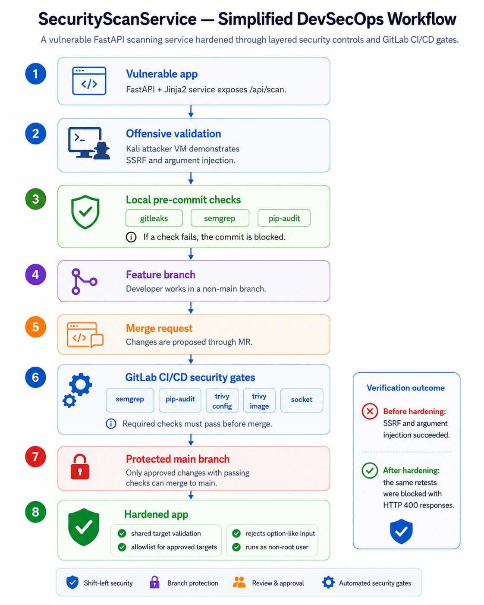
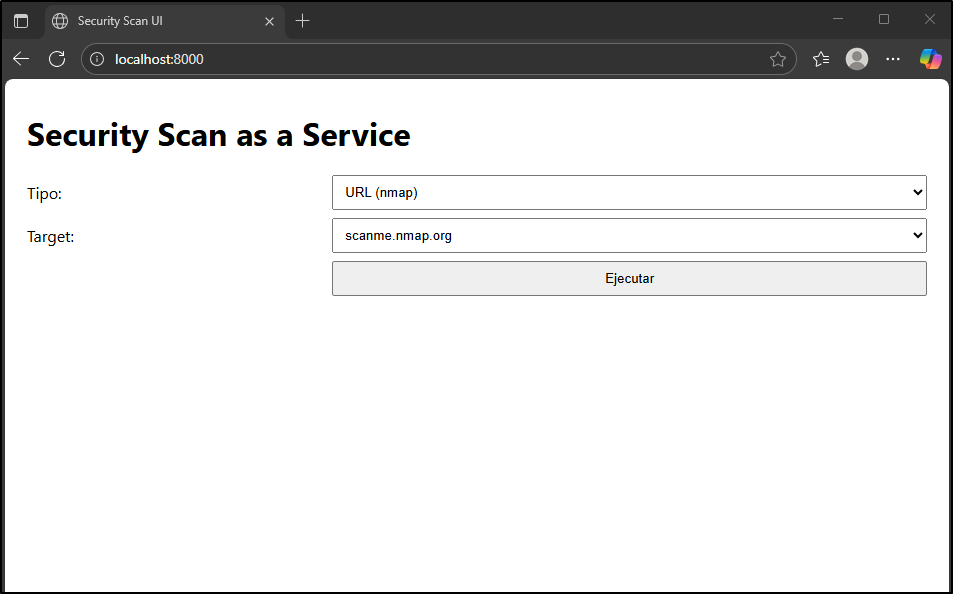
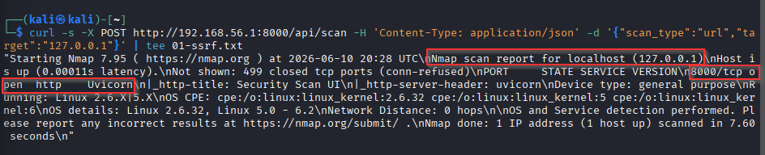
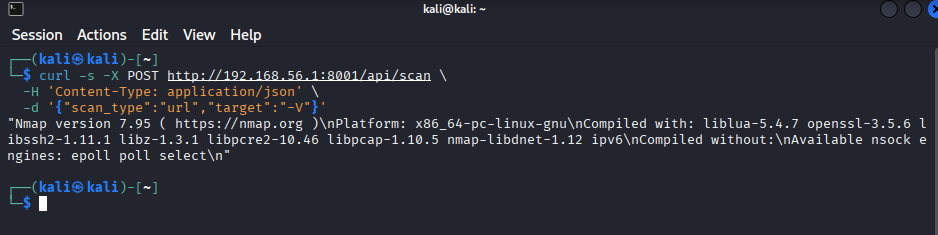
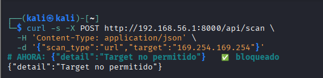
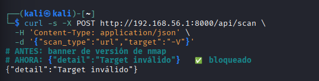
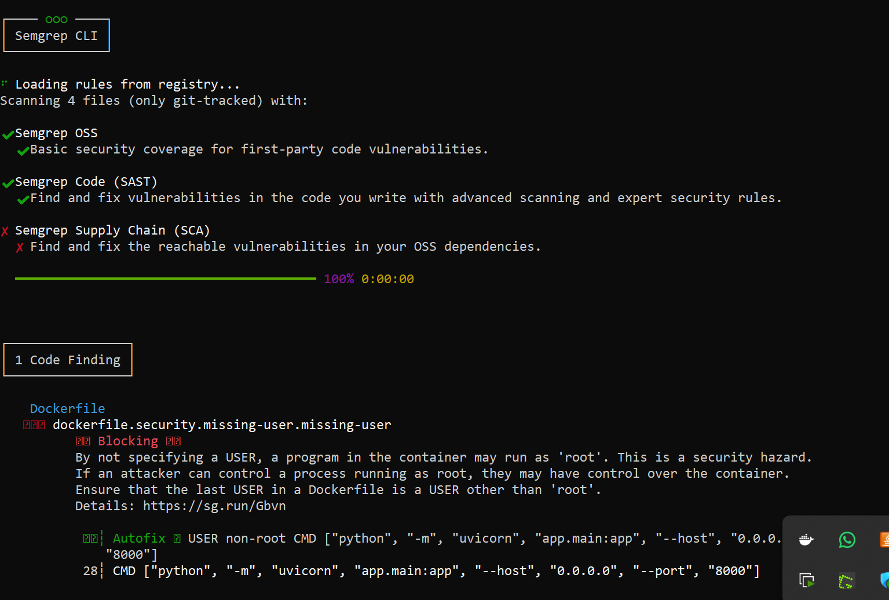
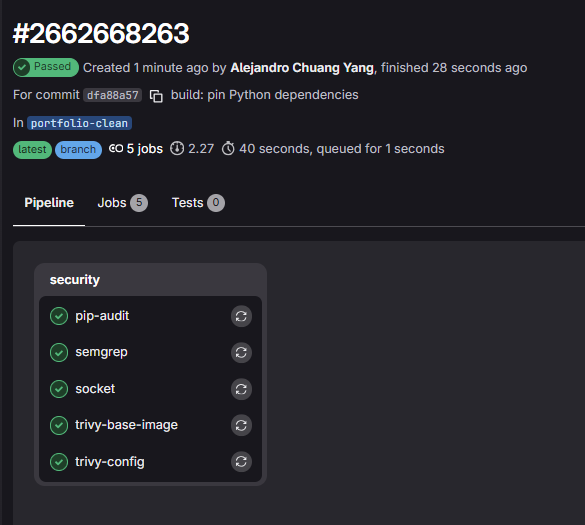

# SecurityScanService

SecurityScanService is a deliberately vulnerable FastAPI scanning service used to demonstrate offensive validation, secure coding controls, protected branches, and GitLab CI/CD security gates.

> **CI/CD note:** The pipeline was designed and validated in GitLab CI/CD.
> GitHub is used as the public portfolio mirror.



## Overview

SecurityScanService provides a small web interface and API for:

- scanning an approved host with Nmap;
- scanning an approved container image with Trivy.

The application was initially tested from a separate Kali Linux attacker VM. The assessment identified two weaknesses in the API:

- server-side scanning of arbitrary internal targets;
- argument injection into Nmap.

The application was then hardened, the same attacks were repeated, and the remediations were verified manually and through automated tests.

## Application



The public demo is intentionally restricted to:

| Scan type | Approved target |
|---|---|
| Nmap | `scanme.nmap.org` |
| Trivy | `ubuntu:latest` |

## Security findings

### Before hardening

The vulnerability was not a missing validation everywhere — it was an **inconsistent** one. The UI endpoint (`/ui/scan`) validated its input, but the API endpoint (`/api/scan`) passed the caller's `target` straight to `subprocess`, with no allowlist and no rejection of option-like input:

```python
# /api/scan — previous vulnerable version (tag: v0-vulnerable)
@app.post("/api/scan", response_class=JSONResponse)
def api_scan(scan: ScanRequest):
    if scan.scan_type == "url":
        result = scan_url(scan.target)      # ← target goes straight to subprocess:
    elif scan.scan_type == "docker":        #    no allowlist, no "-" check
        result = scan_image(scan.target)
    ...
    return result
```

This is a classic failure mode: the control existed, but it was not applied consistently across every surface. The attacker VM targeted the unguarded `/api/scan`.

**SSRF / arbitrary server-side scanning.** The API let the caller choose *any* target, so the scan could be pointed back at the server's own internal network instead of an approved external host. Sending `target: 127.0.0.1` made the service scan **itself** — the Nmap output revealed an internal service (`Uvicorn` on port 3000) that is never exposed publicly. The same trick against `169.254.169.254` (the cloud metadata endpoint) is how SSRF is escalated into credential theft.

```bash
# attacker VM → the API scans the server's own loopback
curl -s -X POST http://<target>:8000/api/scan   -H 'Content-Type: application/json'   -d '{"scan_type":"url","target":"127.0.0.1"}'
# → Nmap scan report for localhost (127.0.0.1) … 3000/tcp open http Uvicorn
```

**Argument injection.** The caller-supplied `target` was placed directly into the Nmap argument list. A value starting with `-` is therefore parsed by Nmap as an **option**, not a target — the caller controls part of the command. `target: -V` ran `nmap -V` (print version); a value like `--script=vuln` would change Nmap's behaviour entirely.

```bash
# attacker VM → the target is interpreted as an Nmap flag
curl -s -X POST http://<target>:8000/api/scan   -H 'Content-Type: application/json'   -d '{"scan_type":"url","target":"-V"}'
# → Nmap version 7.95 … (the flag executed instead of a scan)
```

**SSRF / arbitrary server-side scanning**: The API accepted `127.0.0.1` and scanned an internal service `Uvicorn:3000`.

 

**Argument injection**: The value `-V` was interpreted as an Nmap option, not a target.



### Remediation

A single shared validation layer was applied to **both** the web interface and the API, closing the inconsistency and adding an explicit rejection of option-like input:

```python
def validate_target(scan_type: str, target: str) -> None:
    """Reject unsupported scan types, arbitrary targets and option-like input."""
    if scan_type not in ALLOWED_TARGETS:
        raise HTTPException(status_code=400, detail="scan_type no válido")
    if target.startswith("-"):                    # blocks argument injection (-V, --script=…)
        raise HTTPException(status_code=400, detail="Target inválido")
    if target not in ALLOWED_TARGETS[scan_type]:  # blocks SSRF / arbitrary targets
        raise HTTPException(status_code=400, detail="Target no permitido")
```

Both entry points now call it before any command runs — `validate_target()` is the first line of `/api/scan` and `/ui/scan` alike. Container execution was also changed from root to a non-privileged user.

### Verification after hardening

| SSRF retest | Argument injection retest |
|---|---|
| Cloud metadata endpoint requests are rejected with HTTP 400. | Option-like input is rejected before Nmap executes. |
|  |  |

Automated tests also verify that rejected input **never reaches** `subprocess.run()` — the test replaces `subprocess.run` with a function that fails if it is ever called:

```python
def fail_if_subprocess_runs(*args, **kwargs):
    raise AssertionError("subprocess.run must not execute for a rejected target")

@pytest.mark.parametrize("target", ["-V", "--script=vuln"])
def test_blocks_argument_injection(monkeypatch, target):
    monkeypatch.setattr(subprocess, "run", fail_if_subprocess_runs)
    response = client.post("/api/scan", json={"scan_type": "url", "target": target})
    assert response.status_code == 400          # rejected before any command runs
```

## DevSecOps controls

### Local pre-commit controls

| Control | Purpose |
|---|---|
| Gitleaks | Detect hardcoded secrets |
| Semgrep | Static application security testing |
| pip-audit | Detect known vulnerabilities in Python dependencies |

A failed control blocks the local commit. The three hooks run on every `git commit` via `.pre-commit-config.yaml`:

```yaml
repos:
  - repo: https://github.com/gitleaks/gitleaks          # hardcoded secrets
    hooks: [ { id: gitleaks } ]
  - repo: https://github.com/semgrep/semgrep            # SAST on app code + Dockerfile
    hooks:
      - id: semgrep
        args: [ --config, auto, --error ]
  - repo: https://github.com/pypa/pip-audit             # known CVEs in dependencies
    hooks:
      - id: pip-audit
        args: [ -r, requirements.txt ]
```



### GitLab CI/CD security gates

The GitLab pipeline runs security jobs in parallel:

| Job | Coverage | Policy |
|---|---|---|
| Semgrep | Application code and Dockerfile | Blocking |
| pip-audit | Python dependencies | Blocking |
| Trivy config | Container configuration | Informational |
| Trivy image | Base-image OS vulnerabilities | Informational |
| Socket | Supply-chain and dependency risk | Blocking |

Informational jobs use `allow_failure: true`; blocking jobs (no `allow_failure`) stop the merge. The Socket gate catches supply-chain risk that CVE scanners miss (typosquats, malicious install scripts):

```yaml
socket:
  stage: security
  image: python:3.11-slim
  before_script:
    - apt-get update && apt-get install -y --no-install-recommends git
  script:
    - pip install --no-cache-dir socketsecurity
    - socketcli --api-token "$SOCKET_SECURITY_API_KEY" --target-path . --integration gitlab
```



The `main` branch is protected, direct pushes are rejected, and changes must enter through a merge request with the required checks passing.

## Run locally

### Docker

```bash
docker build -t securityscanservice .
docker run --rm -p 8000:8000 securityscanservice
```

Open `http://localhost:8000`.

### Tests

```bash
python -m venv .venv
source .venv/bin/activate
pip install -r requirements.txt -r requirements-dev.txt
pytest -q
```

The automated test suite verifies:

- application availability;
- approved Nmap execution;
- localhost and cloud-metadata SSRF blocking;
- Nmap option and script argument injection blocking;
- rejected inputs never reach `subprocess.run()`.

## Key design decisions

- Validate all targets before executing system commands.
- Use deterministic tools as security gates.
- Combine fast local feedback with enforceable CI/CD checks.
- Run the application as a non-root user.
- Exclude development dependencies from the runtime image.
- Keep each security tool focused on a distinct responsibility.

The container runs as a dedicated non-root user, and application files are owned by that user rather than root:

```dockerfile
RUN useradd --create-home --uid 10001 appuser
COPY --chown=appuser:appuser app/ ./app/
USER appuser
```

## Technology

Python · FastAPI · Jinja2 · Docker · Nmap · Trivy · GitLab CI/CD · Semgrep · Gitleaks · pip-audit · Socket

## Disclaimer

This project is an isolated security demonstration. Scanning is restricted to explicitly approved targets and must not be used against systems without authorization.
